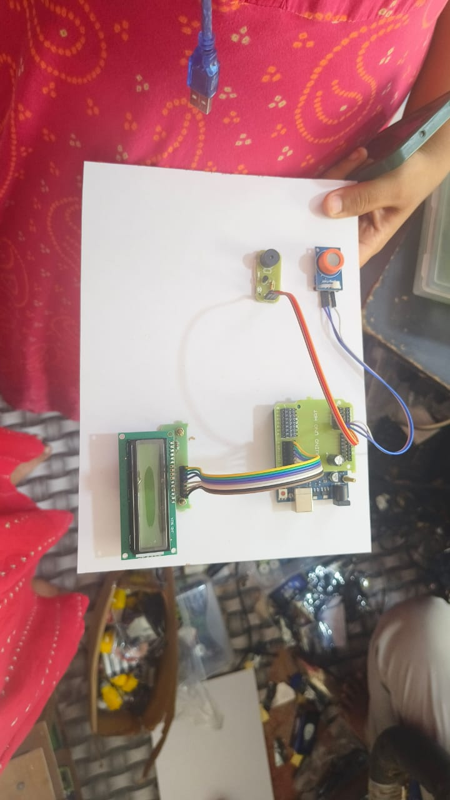

# 🚗 Vigil Eye – Smart Driver Safety Monitoring System 👁️😴

A real-time **Driver Safety Monitoring System** developed using **Python, OpenCV, Dlib, Arduino Uno, and Embedded Systems** to detect driver drowsiness and provide instant alerts for improving road safety.

---

## 📖 Project Overview

Road accidents caused by driver fatigue are one of the major challenges in transportation safety. **Vigil Eye** is a smart driver safety monitoring system designed to detect signs of driver drowsiness using computer vision techniques and embedded hardware.

The system continuously monitors the driver's eye movements through a webcam. Using facial landmark detection and the **Eye Aspect Ratio (EAR)** algorithm, it detects prolonged eye closure, which is a strong indicator of drowsiness. When fatigue is detected, the system communicates with an **Arduino Uno** to activate a buzzer and display alerts, helping the driver stay alert and reducing the risk of accidents.

This project was developed collaboratively as part of our **Engineering Clinics (ECS2002)** course. The implementation was inspired by **research papers, IEEE publications, OpenCV documentation, Dlib documentation, and other educational resources**. Based on these references, our team designed and implemented a working prototype by integrating software and hardware components.

---

## ❗ Problem Statement

Driver drowsiness is one of the leading causes of road accidents, especially during long-distance travel and night driving. Existing monitoring systems are often expensive and difficult to implement.

The objective of this project is to develop a low-cost, real-time driver monitoring system capable of detecting drowsiness and immediately alerting the driver using both computer vision and embedded hardware.

---

## 🎯 Objectives

- Detect driver drowsiness in real time.
- Monitor eye movements using Eye Aspect Ratio (EAR).
- Generate instant alerts using Arduino Uno.
- Integrate computer vision with embedded hardware.
- Develop a simple, affordable, and reliable safety monitoring system.

---

## ✨ Features

- 👤 Real-time Face Detection
- 👁️ Facial Landmark Detection
- 📊 Eye Aspect Ratio (EAR) Calculation
- 😴 Driver Drowsiness Detection
- 🔔 Real-time Buzzer Alert
- 📟 LCD Display Notifications
- 🔌 Arduino Uno Integration
- 💻 Real-time Video Processing
- ⚡ Low-cost Prototype

---

## 🛠️ Hardware Used

- Arduino Uno
- USB Webcam
- 16×2 LCD Display
- MQ Series Alcohol Sensor
- Buzzer
- Arduino Shield
- Jumper Wires
- USB Cable
- Power Supply

---

## 💻 Software & Technologies Used

- Python
- OpenCV
- Dlib
- NumPy
- SciPy
- Imutils
- Arduino IDE
- C Programming (Arduino)
- Computer Vision
- Image Processing

---

## 📦 Requirements

- Python 3.8 or later
- OpenCV
- Dlib
- NumPy
- SciPy
- Imutils
- Arduino IDE

Install the required Python packages:

```bash
pip install opencv-python
pip install dlib
pip install numpy
pip install scipy
pip install imutils
```

---

## ⚙️ Working Principle

1. The webcam continuously captures the driver's face.
2. OpenCV detects the driver's face from each frame.
3. Dlib extracts facial landmarks around both eyes.
4. The Eye Aspect Ratio (EAR) is calculated continuously.
5. If the EAR remains below a predefined threshold for several consecutive frames, the system detects drowsiness.
6. Python communicates with the Arduino Uno.
7. Arduino activates the buzzer and displays an alert on the LCD to notify the driver.

---

## 📂 Project Structure

```
Vigil-Eye/
├── hardware_setup.jpg
├── hardware_demo.mp4
├── models/
├── Drowsiness_Detection.py
├── README.md
├── requirements.txt
└── LICENSE
```

---

## 📸 Hardware Prototype

The hardware prototype developed for the project is shown below.

### Hardware Components

- Arduino Uno
- LCD Display
- MQ Series Alcohol Sensor
- Buzzer
- Jumper Wires
- Arduino Shield

<p align="center">
  
</p>

---

## 🎥 Hardware Demonstration

A demonstration video of the working hardware prototype is included in this repository.

▶️ **Hardware Demo**

[Click here to watch the hardware demonstration](vigil_eye_hardware_setup.mp4)

---

## 📈 Results

The developed prototype successfully detects driver drowsiness in real time using computer vision techniques. When prolonged eye closure is detected, the system immediately generates alerts through the Arduino-controlled buzzer and LCD display.

The project demonstrates the successful integration of computer vision with embedded systems to provide an affordable driver safety monitoring solution.

---

## 🚀 Future Enhancements

- 😮 Yawning Detection
- 😷 Face Mask Detection
- ❤️ ECG-based Driver Monitoring
- ☁️ IoT-Based Remote Monitoring
- 📱 Mobile Application Integration
- 🤖 Deep Learning-Based Fatigue Detection
- 📊 Cloud-Based Data Analytics

---

## 👥 Team Contribution

This project was developed collaboratively as part of the **Engineering Clinics (ECS2002)** course.

The team contributed to:

- Literature Survey
- Research Paper Analysis
- System Design
- Computer Vision Development
- Arduino Programming
- Hardware Integration
- Prototype Development
- Testing and Validation
- Documentation and Presentation

---

## 📚 References

- IEEE Research Papers on Driver Drowsiness Detection
- OpenCV Official Documentation
- Dlib Official Documentation
- Arduino Official Documentation
- PyImageSearch Tutorials

---

## 🙏 Acknowledgment

This project was developed as part of our undergraduate academic curriculum. The implementation was inspired by research papers, IEEE publications, OpenCV documentation, Dlib documentation, Arduino resources, and other educational materials. These references helped our team understand the concepts and implement a practical Driver Safety Monitoring System using computer vision and embedded hardware.

---

⭐ **If you found this project useful, please consider giving it a star!**
